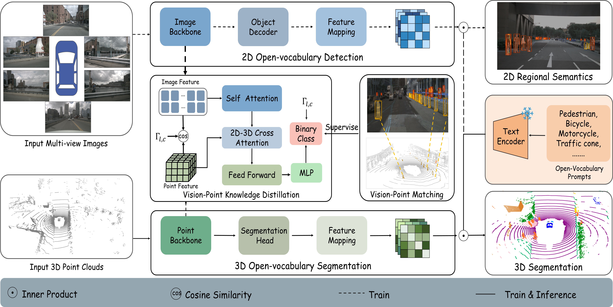
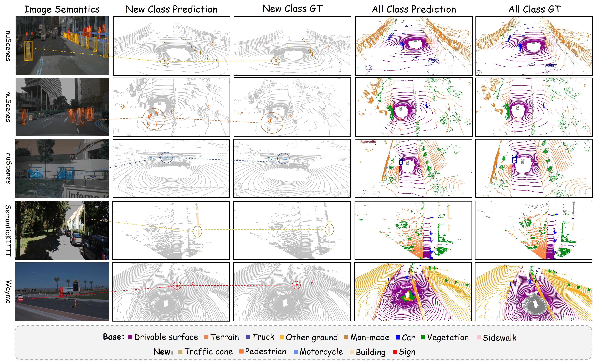
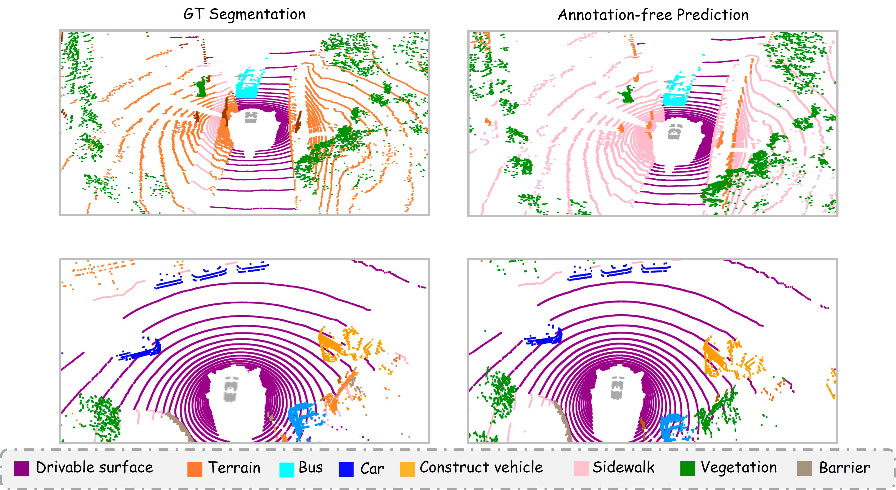

# ORACLE-3D: Open-world Region-aligned Cross-modal Learning for Label-efficient 3D Scene Understanding

<p align="center">
  <a href="#">[Paper]</a> &nbsp;|&nbsp;
  <a href="#">[Project Page]</a>
</p>

> ORACLE-3D is a unified multi-modal framework that transfers rich open-vocabulary knowledge from 2D VLMs to 3D scene understanding, without requiring expensive 3D-text pair construction. At inference time, only a point cloud and text prompts are needed.

---

## News

- **[2026-05]** Code released.

---

## Overview

<p align="center">
  
</p>

ORACLE-3D uses **images as a semantic bridge** between text and point clouds. The framework jointly trains a 2D image branch (initialized from GLEE) and a 3D point cloud branch, distilling open-vocabulary semantics into 3D via:

- **Logit Distillation (LD)** — projects 2D semantic predictions into 3D to supervise novel categories
- **Feature Distillation (FD)** — aligns point cloud latent features with the image-text embedding space
- **Vision-Point Matching (VPM)** — attention-based module that corrects pixel-point misalignments from projection noise
- **Two-stage Training** — 2D warm-up followed by joint multi-modal optimization with four task-specific losses

---

## Results

### Base-annotated Open-world Segmentation

<p align="center">
  
</p>

**nuScenes**

| Method | Backbone | B12/N3 hIoU | B12/N3 mIoU_N | B10/N5 hIoU | B10/N5 mIoU_N |
|--------|----------|:-----------:|:-------------:|:-----------:|:-------------:|
| RegionPLC | SparseUNet32 | 64.5 | 75.8 | 49.0 | 36.3 |
| ORACLE-3D | SparseUNet32 | 68.3 | 62.2 | 65.3 | 57.3 |
| ORACLE-3D | MinkUNet | 64.1 | 56.3 | 64.5 | 57.0 |
| **ORACLE-3D** | **PTv3** | **71.3** | **66.5** | **69.6** | **64.0** |

**ScanNet**

| Method | B15/N4 mIoU_N | B12/N7 mIoU_N | B10/N9 mIoU_N |
|--------|:-------------:|:-------------:|:-------------:|
| RegionPLC | 69.5 | 70.9 | 55.6 |
| **ORACLE-3D** | **75.7** | **69.8** | **67.2** |

### Annotation-free Segmentation (nuScenes)

<p align="center">
  
</p>

| Method | mIoU |
|--------|:----:|
| CLIP2Scene | 20.8 |
| OpenScene | 42.1 |
| MSeg Voting | 31.0 |
| **ORACLE-3D** | **56.9** |

---

## Model Zoo

| Dataset | Backbone | Setting | hIoU | mIoU_N | Weights |
|---------|----------|---------|:----:|:------:|:-------:|
| nuScenes | SparseUNet32 | B12/N3 | 68.3 | 62.2 | coming soon |
| nuScenes | PTv3 | B12/N3 | 71.3 | 66.5 | coming soon |
| ScanNet | SparseUNet32 | B15/N4 | — | 75.7 | coming soon |

---

## Installation

**1. Clone the repository**

```bash
git clone https://github.com/xxx/oracle3d.git
cd oracle3d
```

**2. Install core dependencies**

```bash
pip install -r requirements.txt
```

**3. Install additional dependencies**

```bash
# Sparse 3D convolutions
pip install MinkowskiEngine==0.5.3

# 2D detection backbone
pip install detectron2  # https://github.com/facebookresearch/detectron2

# 2D label generator
# Follow GLEE installation: https://github.com/FoundationVision/GLEE

# Optional: mask refinement
pip install segment-anything-2  # https://github.com/facebookresearch/sam2
```

---

## Data Preparation

```
data/
├── nuscenes/          # nuScenes v1.0 (https://www.nuscenes.org)
├── kitti/             # SemanticKITTI (http://semantic-kitti.org)
├── waymo/             # Waymo Open Dataset
└── scannet/           # ScanNet v2 (http://www.scan-net.org)
```

Dataset splits are provided under `splits/`.

---

## Usage

**Pretraining**

```bash
python pretrain.py --cfg_file config/foundationTrans_nuscenes_pretrain.yaml
```

**Fine-tuning**

```bash
python downstream.py \
    --cfg_file config/foundationTrans_scannet_downstream.yaml \
    --pretraining_path /path/to/pretrained.ckpt
```

**Evaluation**

```bash
python evaluate.py \
    --cfg_file config/foundationTrans_scannet_downstream.yaml \
    --pretraining_path /path/to/trained.ckpt
```

**Annotation-free Inference**

Set `mode: source_free` in the config, then:

```bash
python downstream.py \
    --cfg_file config/foundationTrans_nuscenes_labelfree.yaml \
    --pretraining_path /path/to/glee_pretrained.ckpt
```

---

## Citation

```bibtex
@inproceedings{oracle3d,
  title  = {ORACLE-3D: Open-world Region-aligned Cross-modal Learning for Label-efficient 3D Scene Understanding},
  year   = {2026}
}
```

---

## Acknowledgements

- [GLEE](https://github.com/FoundationVision/GLEE) — open-vocabulary 2D detection backbone
- [CLIP](https://github.com/openai/CLIP) — text encoder
- [MinkowskiEngine](https://github.com/NVIDIA/MinkowskiEngine) — sparse 3D convolutions
- [RegionPLC](https://github.com/CVMI-Lab/RegionPLC) — open-world 3D segmentation baseline
- [OpenScene](https://github.com/pengsongyou/openscene) — open-vocabulary 3D scene understanding
